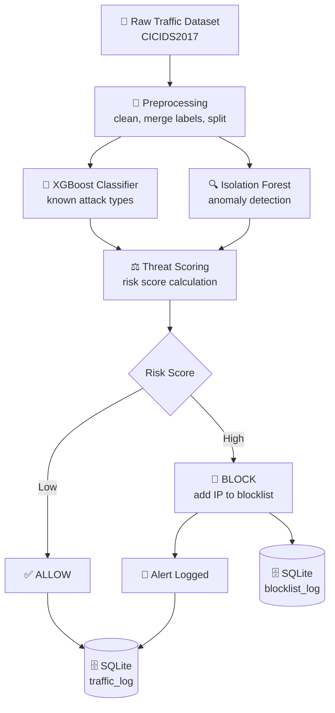

# 🛡️ Enterprise Intrusion Prevention System (IPS)

An academic prototype that detects and **actively blocks** malicious network traffic using a hybrid machine learning approach — built by a 4-member B.Tech Computer Science team.

Unlike a traditional IDS that only *alerts*, this system completes the loop: **detect → score → block** — using a real dataset, a trained classifier, an anomaly detector, and a live blocklist.

---

## 📖 Overview

Modern networks face constant attacks — DDoS, port scanning, brute-force logins, botnet traffic. This project simulates an enterprise-grade prevention pipeline on real network flow data (CICIDS2017), demonstrating both:

- ✅ **Detection** — classifying traffic as normal or malicious
- 🚫 **Prevention** — automatically blocking malicious source IPs, not just logging them

Built to be understandable, defensible in a viva, and free of unnecessary complexity.

---

## ✨ Key Features

- 🌲 **Hybrid ML detection** — XGBoost classifier for known attack types + Isolation Forest for unknown/anomalous traffic
- ⚖️ **Risk-based scoring** — combines model confidence with attack severity to decide allow vs. block
- 🔒 **Real-time blocklist** — once an IP is blocked, future traffic from it is rejected instantly, without needing a fresh prediction
- 📊 **Measurable results** — accuracy, precision/recall/F1, confusion matrix, and system throughput
- 🧩 **Contract-based architecture** — each module communicates through defined Python data structures, not a shared database, so modules can be built and tested independently
- 🗃️ **SQLite logging** — every decision is recorded for later analysis

---

## 🏗️ Architecture



**Data flow principle:** Modules 1→2→3 exchange plain Python objects in memory (`TrafficFeatures` → `PredictionResult` → `Decision`). Only the orchestrator (Module 4) touches the database — this keeps every module independently testable.

---

## 📂 Project Structure

```
enterprise-ips/
│
├── 📁 data/
│   ├── raw/                    # 🚫 gitignored — dataset not committed
│   ├── processed/               # 🚫 gitignored — generated train/test splits
│   ├── sample/
│   │   └── sample.csv            # ✅ small committed sample for testing
│   └── DATASET.md                # download + regeneration instructions
│
├── 📁 common/
│   ├── __init__.py
│   └── schemas.py                 # shared data contracts between modules
│
├── 📁 preprocessing/               # 👤 Member 1
│   ├── verify_dataset.py            # dataset class distribution check
│   └── preprocess.py                # cleaning, label merging, IP simulation
│
├── 📁 detection/                    # 👤 Member 2
│   ├── train_model.py                # trains XGBoost + Isolation Forest
│   ├── predict.py                    # prediction contract
│   └── models/                       # 🚫 gitignored — regenerated locally
│
├── 📁 prevention/                     # 👤 Member 3
│   ├── risk_scorer.py                  # risk scoring + decision logic
│   └── blocklist_manager.py            # in-memory blocklist with expiry
│
├── 📁 backend/                          # 👤 Member 4
│   ├── database.py                       # SQLite schema + logging
│   ├── run_pipeline.py                   # orchestrates modules 1→2→3
│   └── ips.db                            # 🚫 gitignored — regenerated per run
│
├── 📁 tests/                              # unit tests per module
├── 📁 docs/                                # report material (in progress)
├── config.py                                # thresholds, paths, class list
├── requirements.txt
├── .gitignore
└── README.md
```

---

## ⚙️ Setup & Installation

### 1. Clone the repository
```bash
git clone <your-repo-url>
cd enterprise-ips
```

### 2. Create a virtual environment (recommended)
```bash
python -m venv .venv
source .venv/bin/activate      # Windows: .venv\Scripts\activate
```

### 3. Install dependencies
```bash
pip install -r requirements.txt
```
Or individually:
```bash
pip install pandas numpy scikit-learn xgboost joblib
```

### 4. Download the dataset
Get **CICIDS2017 (MachineLearningCVE)** from the [Canadian Institute for Cybersecurity](https://www.unb.ca/cic/datasets/ids-2017.html), then:
```bash
mkdir -p data/raw
unzip MachineLearningCVE.zip -d data/raw/
```
Full instructions: [`data/DATASET.md`](data/DATASET.md)

### 5. Run the pipeline, in order
```bash
python -m preprocessing.preprocess     # clean data, build train/test/sample sets
python -m detection.train_model        # train classifier + anomaly detector
python -m backend.run_pipeline         # run the full detection→prevention pipeline
```

> ⚠️ **Always run modules with `-m` from the project root** (e.g. `python -m detection.predict`, not `python detection/predict.py`) — this ensures shared imports (`config`, `common`) resolve correctly.

---

## 🧪 Testing

No external test framework is used yet — each module ships with a built-in manual test (`if __name__ == "__main__":` block) that can be run directly and verified against expected output below.

| Module | Command | Tool | What it verifies |
|---|---|---|---|
| Preprocessing | `python preprocessing/verify_dataset.py` | pandas | Real class distribution in raw dataset |
| Detection | `python -m detection.predict` | pandas, joblib | Classifier + anomaly detector agree with expectations on a known sample |
| Prevention | `python -m prevention.risk_scorer` | pure Python | 5 scenario-based scoring/blocking decisions |
| Full pipeline | `python -m backend.run_pipeline` | SQLite | End-to-end throughput and allow/block counts |

### Prevention module — test cases and expected responses

```text
Known DDoS:
  Decision(risk_score=0.95, action='BLOCK',
           reason='Risk score 0.95 >= threshold, class=DDoS')

Repeat attempt from the same IP:
  Decision(risk_score=1.0, action='BLOCK',
           reason='IP 10.0.1.1 is already on the blocklist')

Normal BENIGN traffic:
  Decision(risk_score=0.0, action='ALLOW',
           reason='Predicted BENIGN, no anomaly')

Anomalous traffic classified as BENIGN:
  Decision(risk_score=0.6, action='ALLOW',
           reason='Classifier predicted BENIGN but anomaly detector
                    flagged it -- possible unknown attack pattern')

Low-confidence prediction:
  Decision(risk_score=0.0, action='ALLOW',
           reason='Low confidence (0.55), not acting on prediction')
```

### Detection module — sample check
```text
True label: DDoS
Predicted: DDoS (confidence: 0.97X)
Anomaly: False (score: 0.1XX)
```

### Database verification
```bash
python -c "import sqlite3; c = sqlite3.connect('backend/ips.db'); print(c.execute('SELECT action, COUNT(*) FROM traffic_log GROUP BY action').fetchall())"
```

---

## 📊 Model Performance

| Metric | Result |
|---|---|
| Classifier | XGBoost (multi-class) |
| Anomaly detector | Isolation Forest (trained on BENIGN traffic only) |
| Accuracy | ~0.99 on held-out test set |
| Weakest class | `Bot` (smallest class, ~1,966 samples) |
| Anomaly threshold | Derived from the 5th percentile of BENIGN scores, not hardcoded |

*(Exact figures depend on the training run — see console output of `train_model.py` for the current model's full classification report and confusion matrix.)*

---

## 🗺️ Roadmap

- [ ] Full integration test across all 4 modules on the complete dataset
- [ ] Live traffic replay simulator
- [ ] Interactive dashboard (traffic stats, blocked IPs, attack breakdown)
- [ ] FastAPI layer exposing pipeline results
- [ ] Final report and evaluation write-up

---

## 👥 Team & Modules

| Member | Module | Owns |
|---|---|---|
| 1 | Data & Preprocessing | `preprocessing/` |
| 2 | ML Detection | `detection/` |
| 3 | Threat Scoring & Blocking | `prevention/` |
| 4 | Orchestration & Storage | `backend/` |

---

## ⚠️ Scope Note

This is an **academic prototype**, not a production security system. Source IPs are simulated (the CICIDS2017 flow-feature dataset does not include real IP addresses). All testing runs on local datasets — no live network traffic is captured or analyzed.
