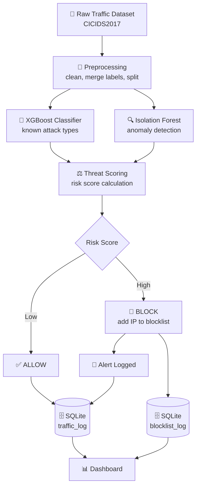

# 🛡️ Enterprise Intrusion Prevention System (IPS)

An academic prototype that detects and **actively blocks** malicious network traffic using a hybrid machine learning approach — built by a 4-member B.Tech Computer Science team.

Unlike a traditional IDS that only *alerts*, this system completes the loop: **detect → score → block** — using a real dataset, a trained classifier + anomaly detector, a live blocklist, a replay-based demo mode, and a results dashboard.

---

## 📖 Overview

Modern networks face constant attacks — DDoS, port scanning, brute-force logins, botnet traffic. This project simulates an enterprise-grade prevention pipeline on real network flow data (CICIDS2017), demonstrating both:

- ✅ **Detection** — classifying traffic as normal or malicious, with a second layer catching unknown patterns
- 🚫 **Prevention** — automatically blocking malicious source IPs, not just logging them

The system is fully built and evaluated end-to-end: **99.91% classification accuracy**, a tuned prevention layer proven on 50,000 real records, a live-feeling replay demo, and a results dashboard.

---

## ✨ Key Features

- 🌲 **Hybrid ML detection** — XGBoost classifier for 5 known attack types + Isolation Forest for unknown/anomalous traffic
- ⚖️ **Risk-based scoring** — combines model confidence with attack severity, empirically tuned against real pipeline results
- 🔒 **Real-time blocklist** — once an IP is blocked, future traffic from it is rejected instantly, without needing a fresh prediction
- 🎬 **Live replay demo mode** — feeds traffic in one record at a time with a visible delay, for a live-feeling presentation
- 📊 **Interactive dashboard** — traffic stats, attack breakdown chart, blocked IPs, and recent alerts
- 📈 **Measurable results** — accuracy, precision/recall/F1, confusion matrix, block rates, and system throughput, all documented in `docs/phase1-evaluation-report.md`
- 🧩 **Contract-based architecture** — each module communicates through defined Python data structures, not a shared database, so modules can be built and tested independently
- 🗃️ **SQLite logging** — every decision is recorded for dashboard visualization and analysis

---

## 🏗️ Architecture



**Data flow principle:** Modules 1→2→3 exchange plain Python objects in memory (`TrafficFeatures` → `PredictionResult` → `Decision`). Only the orchestrator (Module 4) touches the database — this keeps every module independently testable.

---

## 📂 Project Structure

```
enterprise-ips/
│
├── 📁 data/
│   ├── raw/                    # 🚫 gitignored — dataset not committed
│   ├── processed/               # 🚫 gitignored — generated train/test splits
│   ├── sample/
│   │   └── sample.csv            # ✅ small committed sample for testing
│   └── DATASET.md                # download + regeneration instructions
│
├── 📁 common/
│   ├── __init__.py
│   └── schemas.py                 # shared data contracts between modules
│
├── 📁 preprocessing/               # 👤 Member 1
│   ├── verify_dataset.py            # dataset class distribution check
│   ├── preprocess.py                # cleaning, label merging, IP simulation
│   └── replay_simulator.py          # live traffic replay for demos
│
├── 📁 detection/                    # 👤 Member 2
│   ├── train_model.py                # trains XGBoost + Isolation Forest
│   ├── predict.py                    # prediction contract
│   └── models/                       # 🚫 gitignored — regenerated locally
│
├── 📁 prevention/                     # 👤 Member 3
│   ├── risk_scorer.py                  # risk scoring + decision logic
│   └── blocklist_manager.py            # in-memory blocklist with expiry
│
├── 📁 backend/                          # 👤 Member 4
│   ├── database.py                       # SQLite schema + logging
│   ├── run_pipeline.py                   # orchestrates modules 1→2→3 (batch + live modes)
│   ├── export_dashboard_data.py          # exports DB state to dashboard/data.json
│   └── ips.db                            # 🚫 gitignored — regenerated per run
│
├── 📁 dashboard/
│   ├── index.html                        # results dashboard (stats, charts, alerts)
│   └── data.json                         # 🚫 gitignored — generated output
│
├── 📁 docs/
│   └── phase1-evaluation-report.md        # consolidated results write-up
│
├── 📁 tests/                              # unit tests per module
├── config.py                                # thresholds, paths, class list
├── requirements.txt
├── .gitignore
├── README.md
└── Enterprise_IPS_Project_Report.docx        # full academic report
```

---

## ⚙️ Setup & Installation

### 1. Clone the repository
```bash
git clone https://github.com/ShhahilVermaa/enterprise-ips.git
cd enterprise-ips
```

### 2. Create a virtual environment (recommended)
```bash
python -m venv .venv
source .venv/bin/activate      # Windows: .venv\Scripts\activate
```

### 3. Install dependencies
```bash
pip install -r requirements.txt
```
Or individually:
```bash
pip install pandas numpy scikit-learn xgboost joblib
```

### 4. Download the dataset
Get **CICIDS2017 (MachineLearningCVE)** from the [Canadian Institute for Cybersecurity](https://www.unb.ca/cic/datasets/ids-2017.html), then:
```bash
mkdir -p data/raw
unzip MachineLearningCVE.zip -d data/raw/
```
Full instructions: [`data/DATASET.md`](data/DATASET.md)

### 5. Run the full pipeline, in order
```bash
python -m preprocessing.preprocess     # clean data, build train/test/sample sets
python -m detection.train_model        # train classifier + anomaly detector
python -m backend.run_pipeline         # run the full detection→prevention pipeline (batch mode)
```

> ⚠️ **Always run modules with `-m` from the project root** (e.g. `python -m detection.predict`, not `python detection/predict.py`) — this ensures shared imports (`config`, `common`) resolve correctly.

### 6. Run the live demo mode (optional)
```bash
python -c "
from backend.run_pipeline import run_live
from config import SAMPLE_DIR
import os
run_live(os.path.join(SAMPLE_DIR, 'sample.csv'), delay_seconds=0.3, max_records=100)
"
```
Traffic streams in one record at a time with a visible pause, printing a `🚫 BLOCKED` line whenever a threat is stopped — this is the mode to run on screen for a live demo.

### 7. Generate and view the dashboard
```bash
python -m backend.export_dashboard_data
cd dashboard
python -m http.server 8000
```
Open **http://localhost:8000** in your browser.

---

## 🧪 Testing

No external test framework is used — each module ships with a built-in manual test (`if __name__ == "__main__":` block) runnable directly and checkable against the expected output below.

| Module | Command | Tool | What it verifies |
|---|---|---|---|
| Preprocessing | `python preprocessing/verify_dataset.py` | pandas | Real class distribution in raw dataset |
| Detection | `python -m detection.predict` | pandas, joblib | Classifier + anomaly detector agree with expectations on a known sample |
| Prevention | `python -m prevention.risk_scorer` | pure Python | 5 scenario-based scoring/blocking decisions |
| Full pipeline | `python -m backend.run_pipeline` | SQLite | End-to-end throughput and allow/block counts |
| Results diagnostics | `python check_results.py` | SQLite | Explains *why* specific records were allowed/blocked |

### Prevention module — test cases and expected responses

```text
Known DDoS:
  Decision(risk_score=0.95, action='BLOCK',
           reason='Risk score 0.95 >= threshold, class=DDoS')

Repeat attempt from the same IP:
  Decision(risk_score=1.0, action='BLOCK',
           reason='IP 10.0.1.1 is already on the blocklist')

Normal BENIGN traffic:
  Decision(risk_score=0.0, action='ALLOW',
           reason='Predicted BENIGN, no anomaly')

Anomalous traffic classified as BENIGN:
  Decision(risk_score=0.6, action='ALLOW',
           reason='Classifier predicted BENIGN but anomaly detector
                    flagged it -- possible unknown attack pattern')

Low-confidence prediction:
  Decision(risk_score=0.0, action='ALLOW',
           reason='Low confidence (0.55), not acting on prediction')
```

### Detection module — sample check
```text
True label: DDoS
Predicted: DDoS (confidence: 0.97X)
Anomaly: False (score: 0.1XX)
```

### Full pipeline — final tuned result (50,000 real records)
```text
Allowed: 31,605 | Blocked: 18,395
Flagged anomalous: 5,023 (10.0%)
Throughput: 38.3 records/sec
```

### Database verification
```bash
python -c "import sqlite3; c = sqlite3.connect('backend/ips.db'); print(c.execute('SELECT action, COUNT(*) FROM traffic_log GROUP BY action').fetchall())"
```

---

## 📊 Model Performance

| Metric | Result |
|---|---|
| Classifier | XGBoost (multi-class) |
| Anomaly detector | Isolation Forest (trained on BENIGN traffic only) |
| Overall accuracy | **99.91%** on 565,130-record held-out test set |
| Weakest class | `Bot` (precision 0.83, recall 0.76 — smallest class, ~1,966 samples) |
| Anomaly threshold | Derived from the 5th percentile of BENIGN scores, not hardcoded |
| Anomaly detector independently caught | **30.26%** of real attacks |

### Prevention results (50,000-record run, tuned)

| Class | Block Rate |
|---|---|
| BENIGN | 21.2% (false positives — see limitations) |
| Bot | 55.0% |
| BruteForce | 100% |
| DDoS | 100% |
| DoS | 99.9% |
| PortScan | 99.75% |

Full breakdown, methodology, and tuning history: [`docs/phase1-evaluation-report.md`](docs/phase1-evaluation-report.md)

---

## 🗺️ Roadmap

- [x] Full integration across all 4 modules on real data
- [x] Shared evaluation and results report
- [x] Traffic replay simulator
- [x] Interactive dashboard
- [x] Full academic report draft
- [ ] Optional: FastAPI layer for live API-driven dashboard updates
- [ ] Batch/vectorized prediction for higher throughput
- [ ] Final report polish (architecture diagram image, screenshots, member contributions)
- [ ] Viva preparation

---

## 👥 Team & Modules

| Member | Module | Owns |
|---|---|---|
| 1 | Data & Preprocessing | `preprocessing/` |
| 2 | ML Detection | `detection/` |
| 3 | Threat Scoring & Blocking | `prevention/` |
| 4 | Orchestration, Storage & Dashboard | `backend/`, `dashboard/` |

---

## ⚠️ Scope Note

This is an **academic prototype**, not a production security system. Source IPs are simulated (the CICIDS2017 flow-feature dataset does not include real IP addresses), which is a documented limitation affecting the false-positive rate — see [`docs/phase1-evaluation-report.md`](docs/phase1-evaluation-report.md) for details. All testing runs on local datasets — no live network traffic is captured or analyzed.
